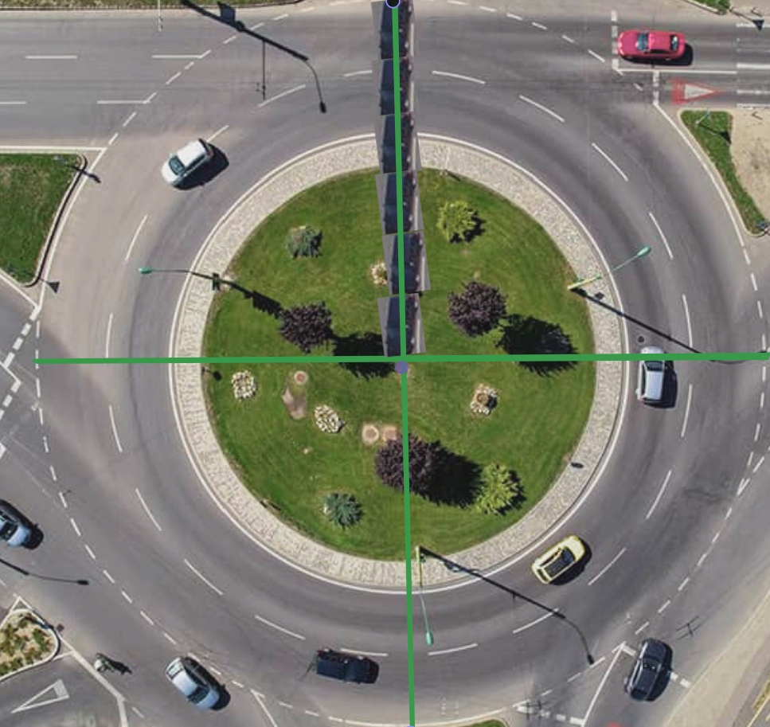

import CarbonIntensity from '../../components/CarbonIntensity.astro';
import RoundaboutApproachCapacity from '../../components/RoundaboutApproachCapacity.astro';

I wanna watch people go around a roundabout a bunch of times? Why? Because it's funny

Think about it—going around one time and getting off at your exit? Boring! Going around like 58 times? Really cool

Also, FIFA is so 1908—we need a change for 2025. Let's replace FIFA with a bunch of people driving around roundabouts

## But driving around in circles for no reason is bad for the environment

Don't let perfect be the enemy of good. Doing something funny like going around a roundabout 4893498 times means you get to tell everyone you know, and they will all say "wow you are super cool and smart, I never thought of that"

I know that pollution is bad and all, but the funny outweighs the environment I think. Here's a cool chart I made proving it


If a lot of people laugh, then they will be happier—and a few degrees warmer if you drive long enough

The Earth can have a few more degrees of global warming as a snack

What? You weren't convinced by my graph? Funniness can't be measured in pounds per minute? Is it even legal to drive in circles for hours on end? Fine, I guess you have a point

## Is it legal to drive around roundabouts unnecessarily?

I'll focus on the US since I'm most familiar with its laws

### States with explicit rules

Some jurisdictions ban cruising—driving for attention instead of reaching a destination. In these places, Circling roundabouts would not be allowed

Cruising is legal in California as of 2023[^caliCruising]

[^caliCruising]: [“Governor Newsom Issues Legislative Update 10.13.23.”](www.gov.ca.gov/2023/10/13/governor-newsom-issues-legislative-update-10-13-23/) Governor of California, 17 June 2024.

Illinois categorizes going around a roundabout more than 2 times as careless driving[^illinois], which is a misdemeanor
[^illinois]: [“Roundabouts FAQ.”](idot.illinois.gov/transportation-system/transportation-safety/roadway-safety/engineering/intersections/idot-roundabouts/faq.html#:~:text=Circling%20a%20roundabout%20more%20than,exit%20at%20the%20desired%20street) Illinois Department of Transportation. Accessed 18 Jan. 2025.

### Implicit rulings

Most states don't explicitly outlaw driving in roundabouts more than necessary

There are always some infractions that can be leveraged to stop someone, but if the police are busy doing more important things, and you aren't blocking traffic or impaired, you should be fine

### Real world examples

Dave Dugan went around a roundabout 1001 times in Indiana in 2022 to raise money for Cancer Support[^indiana]

[^indiana]: WTHR.com staff. [“Comedian Dave Dugan Breaks World Record in Carmel for Time Spent in a Roundabout.”](www.wthr.com/article/news/local/dave-dugan-carmel-roundabout-world-record-carmel/531-b757fea9-df4b-4f16-a2ad-4b805cec10ee) WTHR, 11 May 2022.

Life OD went around a roundabout for 24 hours and only got pulled over once 20 hours in. The officer told them "[there's] nothing criminal about doing circles, however if you start impeding, or obstructing, or making yourself a traffic nuisance, I'm going to make you go away."[^lifeOdVideo]

[^lifeOdVideo]: Life OD. [“Stuck in a Roundabout For 24 Hours Challenge.”](https://www.youtube.com/watch?v=wqF8zLWo570) YouTube, Collection Shield 360, 22 Aug. 2019.

They paid an Uber Eats driver to hand them Subway through the window while they were circling, and they filled up gas while driving

From some of my expert GeoGuesser sleuthing skills, also known as reading the signs frame by frame and reading comments, this was recorded in Granite Falls, Washington

That's to say, at least in Washington, it's legal to circle roundabouts for fun—at least until the police have nothing better to do or enough people complain. They mention being in the roundabout while needing to merge with traffic[^lifeOdVideo], so even impeding traffic has a pretty relaxed definition

Now we know this is legally feasible, how does circling roundabouts compare to the FIFA world cup's CO<sub>2</sub> emissions?

## How much pollution does the FIFA world cup cause anyways?

{/* prettier-ignore */}
<CarbonIntensity>
	1846 flights were associated with the Fifa World cup. 14.7 Kilotons of CO<sub>2</sub> were associated with these flights
</CarbonIntensity>

Ok, so 14.7 kilotons of CO<sub>2</sub> is our anchor point. How much does driving around roundabouts emit?

## Pollution from driving in roundabouts

Let's calculate the grams of CO<sub>2</sub> emitted by one revolution of a roundabout in an average car

### How long is a roundabout?

According to the <abbr title="South Carolina Department of Transportation">SCDOT</abbr> <cite>Roundabout Design Criteria</cite>, <q>[g]enerally, the inscribed circle diameter of a multilane roundabout ranges from 150 feet to 250 feet[^2][^3]. </q> That's 46–76 meters for any non–United–Stateseans out there

[^2]:
        <p>
        	<cite>
        		<a href="https://www.scdot.org/content/dam/scdot-legacy/business/pdf/i26widening/attachb/roadway/Roundabout_Criteria.pdf">
        			“9.1.1 Roundabout Design Criteria.” South Carolina Department of Transportation.
        		</a>
        	</cite>
        </p>

[^3]: It looks like the South Carolina Department of Transportation is using Adobe Experience Manager from the path `/content/dam` serving their assets! Is that enough to make this blog about software engineering?

The actual perimeter driven will be smaller than the outer perimeter since the car can't drive on the edge the roundabout, but we're doing napkin math, so we can just say 200 feet as a diameter and call it a day[^4]

[^4]: Multilane circulatory roadway lane widths typically range from 14 feet to 16 feet[^2], as per the <abbr title="South Carolina Department of Transportation">SCDOT</abbr>

From there we can calculate the miles per trip by finding the perimeter

```math
\frac{\pi \times diameter \text{ ft}}{\text{trip}}
```

```math
\frac{\pi \times 200 \text{ ft}}{\text{trip}}
```

```math
\frac{628 \text{ ft}}{\text{trip}}
```

```math
\frac{628 \text{ ft}}{\text{trip}} \times \frac{\text{mi}}{5280 \text{ft}}
```

```math
\frac{.119 \text{ mi}}{\text{trip}}
```

{/* 0.11899972172 */}

There are around .12 miles per roundabout trip, or .19 kilometers

### How much CO<sub>2</sub> is emitted by driving .12 miles?

According to the EPA, "[t]he average passenger vehicle emits about 400 grams of CO<sub>2</sub> per mile[^5]." This assumes a gas vehicle with 22.2 miles per gallon (9.33 kilometers per liter), and only accounts for tailpipe emissions

[^5]:
        [“Tailpipe Greenhouse Gas Emissions from a Typical Passenger Vehicle EPA-420-F-23-014.”](https://nepis.epa.gov/Exe/ZyPDF.cgi?Dockey=P1017FP5.pdf) U.S. Environmental Protection Agency Office of Transportation and Air Quality, June 2023.

```math
\frac{.119 \text{ mi}}{\text{trip}} \times \frac{400 \text{ g}}{\text{mi}}
```

```math
\frac{47.6 \text{ g}}{\text{trip}}
```

{/* 47.5998886908 */}
One trip around the roundabout emits around 48 grams of CO<sub>2</sub>

### How many trips to equal FIFA's emissions?

How many trips do we need to equal the estimated 14.7 Kilotons from FIFA World Cup related flights?

```math
14.7 \text{ kt} \times \frac{1 \times 10^9 \text{kt}}{\text{g}}
```

```math
14.7 \times 10^9 \text{ g}
```

```math
14.7 \times 10^9 \text{ g} \times \frac{\text{trip}}{47.6 \text{ g}}
```

```math
3.08 \times 10^8 \text{ trip}
```

{/* 308824251.576 */}

310 million roundabout revolutions is a lot more fun than just 1846 flights!

As per the United States Department of Transportation, there are around 233 million licensed drivers in the US as of 2023[^licensed]

[^licensed]: ["Vehicles, Drivers, and Population: U.S. Department of Transportation, Federal Highway Administration, Highway Statistics 2023. Tables DV-1C"](https://www.fhwa.dot.gov/policyinformation/statistics/2023/). September 2023.

That means everyone can get on the fun, as opposed to the select few who can get a passport and afford a plane ticket or private jet. Anyone that can't drive can ride along as a passenger and have the time of their lives!

## How long would it take to do that many trips?

Good question

### How many miles is 310 million trips?

```math
3.1 \times 10^8 \text { trip} \times \frac{.12 \text{ mi}}{\text{trip}}
```

```math
3.67 \times 10^7 \text { mi}
```

{/* 36749999.99793 */}

37 million miles, or 59 million kilometers!

### How long will that take to drive?

According to the <abbr title="South Carolina Department of Transportation">SCDOT</abbr> roundabout design criteria, "[m]aximum entering design speeds of ... 25 to 30 miles[—or 40 to 48 kilometers—]per hour [are recommended] for multilane roundabouts[^2]"

Let's say we're going 30 miles an hour, or 48 kilometers per hour

```math
3.67 \times 10^7 \text { mi} \times \frac{\text{h}}{30 \text{ mi}}
```

```math
1.2 \times 10^6 \text { h}
```

{/* 1224999.99993 */}

1.2 million hours, which is how many years?

A year has 365 days and 6 hours, or 8766 hours

```math
1.2 \times 10^6 \text { h} \times \frac{\text{year}}{8766 \text{ h}}
```

```math
140 \text { year}
```

{/* 139.74446 */}

It would take around 140 years of driving one car at a time around a multilane roundabout to equal the amount of CO<sub>2</sub> emissions of the aircraft used for travel for the FIFA World Cup

## But the FIFA world cup didn't last 140 years

Good point, let's check out that diagram again

<CarbonIntensity>
	The FIFA world cup took place from{' '}
	<time dateTime="2022-11-20">20 November</time> to{' '}
	<time dateTime="2022-12-18">18 December 2022</time>
</CarbonIntensity>

There are 29 days in that range—how many cars would need to drive in parallel to emit 14.7 Kilotons of CO<sub>2</sub>?

First, how many hours are in a day?

```math
29 \text{ day} \times \frac{24 \text{ h}}{ \text{day}}
```

```math
696 \text{ h}
```

So we have around 670 hours to drive during the world cup, how many cars need to be driving at the same time?

```math
1.2 \times 10^6 \text { h} \times \frac{\text { car}}{696 \text{ h}}
```

```math
1760 \text { car}
```

{/* 1760.05747 */}

Around 1800 cars going around roundabouts for 29 consecutive days

## How many roundabouts would we need?

It would be wasteful to have one car per roundabout, so how many cars reasonably fit?

Every document I could find told me more or less to ask a traffic designer, for example, our favorite source, <abbr title="South Carolina Department of Transportation">SCDOT</abbr>, says <q>[o]perational analysis [is] needed to verify upper limit for specific applications</q>[^2]

As per <cite>Roundabouts: An Informational Guide</cite>, <q>[t]he capacity of the entire roundabout is not considered, as it depends on many terms[^10].</q> I can't believe throughput based on maximum capacity isn't a very useful metric—who knew people typically need to leave the roundabout!

[^10]: Robinson, Bruce W., et al. <a href="https://www.fhwa.dot.gov/publications/research/safety/00067/00067.pdf">“Roundabouts: An Informational Guide. Publication No. FHWA-RD-00-067.”</a> U.S Department of Transportation, June 2000.

Luckily, the same document has a beautiful chart showing the regression of circulatory flow and maximum entry flow for 2 lane roundabouts fitting within our parameters![^11]

[^11]: Napkin math for the win! I kinda just picked a round number, and it happened to fit!

<RoundaboutApproachCapacity />

With 0 entry flow, the roundabout supports a circulatory flow of around 3380 vehicles per hour

### How long does it take to go around a roundabout?

We'll use our prior calculations of .12 miles per trip and 30 miles an hour speeds

```math
\frac{.119 \text{ mi}}{\text{trip}} \times \frac{\text{h}}{30 \text{ mi}}
```

```math
\frac{3.96 \times 10^{-3}\text{ h}}{\text{trip}}
```

{/* 0.00396 */}

```math
\frac{3.96 \times 10^{-3}\text{ h}}{\text{trip}} \times \frac{3600 \text{ s}}{\text{h}}
```

```math
\frac{14.2 \text{ s}}{\text{trip}}
```

{/* 14.27996 */}

So it would take around $$4.0 \times 10^{-3}$$ hours—or 14 seconds—to go around a roundabout

### How many cars fit in one roundabout?

Here's a 2 lane roundabout to mock up how many cars could reasonably fit

#### What's the inscribed diameter?



Let's assume this car is 15 feet from front to end

```math
d = 2r
```

```math
d = 2 \times 6 \text{ carLength}
```

```math
d = 2 \times 6 \times 15 \text { ft}
```

```math
d = 180 \text { ft}
```

Pretty close! We'll have to revisit if the extra 20 feet would make a difference, though it's small enough to be in our margin of error anyways

#### How many cars would fit?


There are 46 cars in this roundabout, but they are all right next to each other. They should be around 3 car lengths away to maintain a safe following distance[^carDistance]

[^carDistance]: [CarParts.com Research Team](https://www.carparts.com/blog/author/thecpteam/). [“How Many Car Lengths Between Cars Is The Recommended Following Distance?”](https://www.carparts.com/blog/how-many-car-lengths-between-cars-is-the-recommended-following-distance/) Carparts.Com, 28 Oct. 2024.


Now each car has a 3 car following distance, giving us 7 cars in the outer circle and 6 in the inner, for a total of 13 cars with safe following distances

We likely could fit a 14th car in the outer lane with 20 extra feet, but I'd say this is close enough for our purposes

#### Cross referencing with <cite>Roundabouts: An Informational Guide</cite>

How many cars are estimated to fit from the <cite>Roundabouts: An Informational Guide</cite> estimation?

```math
\frac{3380 \text { car}}{\text{h}} \times
\frac{3.96 \times 10^{-3}\text{ h}}{\text{trip}}
```

```math
\frac{13 \text{ car}}{\text{trip}}
```

13 cars fit in a two lane roundabout! That matches up well with our estimate, especially since <cite>Roundabouts: An Informational Guide</cite> uses more conservative roundabout sizes

### So how many roundabouts would we need?

Remember, we need around 1800 cars driving in circles, and each roundabout can hold 13 cars

```math
1760 \text { car} \times \frac{\text{roundabout}}{13 \text{ car}}
```

```math
135.4 \text{ roundabout}
```

{/* 135.3846 */}

We could block off around 140 roundabouts for the requisite 29 days

Keep in mind, the FIFA world cup causes road closures too, albeit likely less

## But what about traffic?

One step ahead of you! Just like how we build stadiums for sports, we could build a lot of roundabouts next to each other

We could even make it in the shape of the FIFA logo and then everyone wins!


Now you may be saying "but there's not 140 roundabouts there, that's 375[^12], and some of the roundabouts aren't lined up!"

[^12]: The letters in FIFA have 33 roundabouts, and the trophy 342

First of all, watch your tone, I'm not a city planner, nor a pixel artist. I didn't think about using snap mode until after I finished, and I did it all in Excalidraw

Second of all, you got me, I went over the pollution budget, but I think it'd be worth it to keep spirits high. Just imagine the roaring crowds watching the drivers go round and round! I'm getting excited just thinking about it 😀

---

Congratulations, you made it to the end!

I decided to write an article where I just write whatever comes to mind, and here ya go! I wanted to know if it was legal to go around roundabouts for fun, and instead spent more than 50 hours doing math, pixel art, and reading traffic design and legal documents

Moral of the story, Reddit and random articles don't like citing their sources and are sometimes very wrong

Let me know your thoughts. Did I make any math mistakes? Would you like watch drivers circle roundabouts for a month straight?
